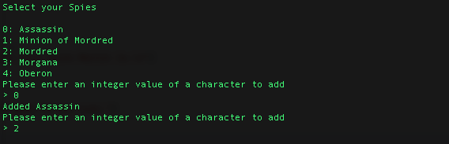
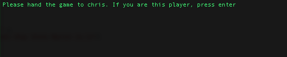
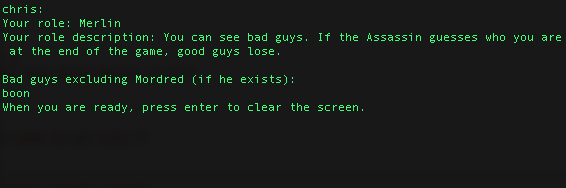
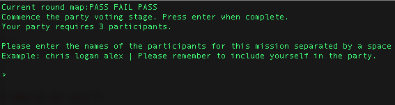
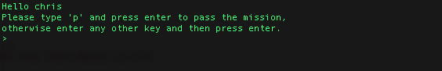

# Resistance-Avalon-CLI

**Supports 5 - 10 people**.  
Supports both Mac and Windows. Linux untested.

A game of Avalon hosted on the command line.  
**Requires Python to run.**

Roles and Quests are handled discretely by clearing the command line after every piece of sensitive information.  

### Included roles:  
* Mordred
* Assassin
* Morgana
* Oberon
* Minion of Mordred
* Merlin
* Percival
* Good Guy (aka Servant of Arthur)

### Images:
Character selection:  

Role assignments:  
  

Party Selection denoting Required Players on Party:  

Voting Mechanics:

